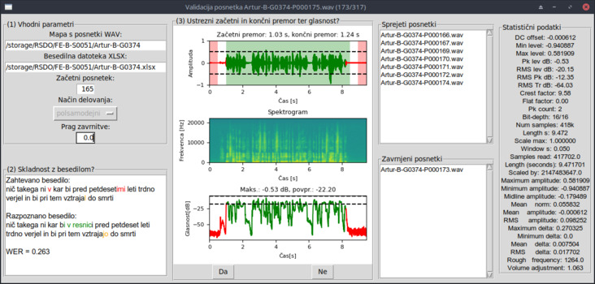

*Read this in other languages: [Slovene](README.sl.md)

# Speech audio validation

This repository contains an application that alleviates the process of verifying the compliance of the speech audio recordings with the predefined requirements including the matching of the spoken text with the reference text, suitability of the initial and final silence lengths and adequacy of the speech volume.

## Installation

The code is written in Python 3. Required libraries can be installed by ```pip install -r requirements.txt```. 

To avoid the installation hassle, executables for [Windows](https://unilj-my.sharepoint.com/:u:/g/personal/janezkrfe_fe1_uni-lj_si/EUk8rVw1B7lGi_FZfrXHtBcB6pLBJAhV2PHNZpCCf5fFSg?e=LhBbgf) and [Linux](https://unilj-my.sharepoint.com/:u:/g/personal/janezkrfe_fe1_uni-lj_si/EasNMx8l5QNGg8U6TQrHyscB9Q-oWLSscv7kmCS_ElhJBQ?e=sAlL71) are also available.

## Usage

The app can be started by executing ```python audio_validation.py```. A graphical user interface is displayed that enables to enter the input parameters, such as the path to the directory with WAV audio recordings, the path to the XLSX text file with the reference text, and the operating mode (manual / automatic / semi-automatic). After entering the input parameters the validation procedure is started by pressing the "Run" button. It is recommended to select the semi-automatic mode with the word error rate threshold set to WER = 0, which allows to manually check all recordings that have not passed the automatic check of compliance with the referece text. 

The first step of the validation process is to check the correctness of the format (channel: mono, sampling frequency: 44.1 kHz, file extension: WAV, subtype: PCM_16). This step is always performed automatically regardless of the operating mode selection.

In the second step the compliance with the reference text is verified. For this purpose there is a frame in the lower left part of the graphical user interface where the reference text is displayed and, if (semi)automatic mode is selected, also automatically recognized text, including the value of the computed WER similarity metric between the reference and the recognized text. In manual mode and in the case of the WER below the predefined threshold in semiautomatic mode, the audio is played, thus allowing a manual assessment of the matching between the spoken text and the reference text. Eifferences between the reference and the automatically recognized text are color coded to help the manual assessment. The audio recording is approved/rejected by pressing the appropriate button, and in case of rejection, a pop-up window opens, which allows to enter the reason of rejection. Beforehand, a "Note" button can also be clicked, where a separate comments can be entered. Rejection descriptions and notes are stored in dedicated cells in the output XLSX file. By pressing the "Repeat" button, the recording is played again.

In the last step, the initial/final silence lengths and the audio volume are checked. In the frame in the middle of the GUI, three graphs (audio amplitude, spectrogram and audio volume) are drawn in manual and semi-automatic mode, which help to assess the suitability of silence lengths and the audio volume. Automatic estimates of silent sections are color coded on the displayed graphs. The lengths of initial and final silence should be between 0.5 s and 1.0 s (white colored background on the graphs), while the audio volume should be above -20 dBFS. The recording is approved or rejected by pressing the suitable key.

## Auxiliary scripts

The [xlsx2txt.py](xlsx2txt.py) script generates a TXT file with a list of rejected WAVs from the input XLSX file. The output TXT file can be used in conjunction with the rsync command when copying approved recordings (--exclude-from) or rejected recordings (--files-from).

The [check_val.py](check_val.py) script checks if the numbers of recordings (#approved = #source - #rejected) match in the local and remote directories.

The [remove_corrected.py](remove_corrected.py) script removes the corrected recordings from the XLSX list of rejected recordings.

## References

[Križaj, Janez; Dobrišek, Simon. "Validacija zvočnih posnetkov pri izdelavi podatkovne zbirke za učenje razpoznavalnika slovenščine", 30th International Electrotechnical and Computer Science Conference, Portorož, Slovenia, pp. 382-385, 2021](https://erk.fe.uni-lj.si/2021/papers/krizaj(validacija_zvocnih).pdf)
